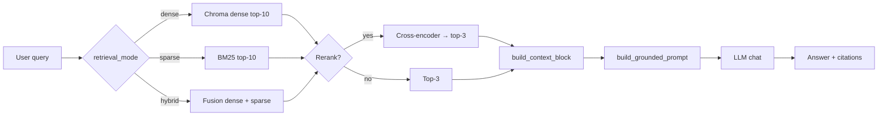

# Architecture — RAG Pipeline (Day 08 Lab)

> Code thực tế nằm trong [`src/`](../src/) (`src/index.py`, `src/rag_answer.py`, `src/eval.py`). Chạy: `PYTHONPATH=src .venv/bin/python src/<script>.py`.

## 1. Tổng quan kiến trúc

```
[Raw Docs trong data/docs/]
    ↓
[src/index.py: preprocess → chunk → embed → upsert]
    ↓
[ChromaDB — chroma_db/]
    ↓
[src/rag_answer.py: retrieve → (rerank) → grounded prompt → LLM]
    ↓
[Câu trả lời có trích dẫn [1], [2], …]
```

**Mô tả ngắn gọn:** Pipeline RAG nội bộ cho IT/HR/CS: index các policy dạng text, truy vấn bằng embedding (và tùy chọn BM25 + hybrid), tùy chọn rerank, rồi sinh câu trả lời chỉ dựa trên ngữ cảnh đã truy vấn — nếu không đủ bằng chứng thì abstain theo câu cố định trong prompt.

---

## 2. Indexing Pipeline (Sprint 1)

### Tài liệu được index

| File | Nguồn (`metadata.source`) | Department | Số chunk |
|------|----------------------------|------------|----------|
| `policy_refund_v4.txt` | policy/refund-v4.pdf | CS | 6 |
| `sla_p1_2026.txt` | support/sla-p1-2026.pdf | IT | 5 |
| `access_control_sop.txt` | it/access-control-sop.md | IT Security | 7 |
| `it_helpdesk_faq.txt` | support/helpdesk-faq.md | IT | 13 |
| `hr_leave_policy.txt` | hr/leave-policy-2026.pdf | HR | 5 |
| **Tổng** | | | **36** |

### Quyết định chunking

| Tham số | Giá trị (code) | Lý do |
|---------|----------------|-------|
| Chunk size | `CHUNK_SIZE = 400` (ước lượng token; trong code quy đổi `× 4` ký tự) | Cân bằng độ dài ngữ cảnh và số chunk |
| Overlap | `CHUNK_OVERLAP = 80` | Giảm cắt giữa đoạn liên quan ở biên chunk |
| Chiến lược | Tách theo heading `=== Section|Phần|Điều N: … ===`; FAQ tách thêm theo `Q:`; đoạn dài `_split_by_size` theo đoạn văn + overlap | Giữ ranh giới điều khoản / câu hỏi FAQ trước khi cắt theo kích thước |
| Metadata | `source`, `section`, `effective_date`, `department`, `access`, … | Filter, freshness, trích dẫn |

### Embedding & vector store

- **Embedding:** `EMBEDDING_MODEL` và `EMBEDDING_PROVIDER` (OpenAI-compatible hoặc Jina nếu cấu hình) — xem [`.env.example`](../.env.example); không dán API key vào tài liệu.
- **Base URL:** `EMBEDDING_BASE_URL` (tách biệt `CHAT_BASE_URL` nếu dùng endpoint khác nhau).
- **Vector store:** Chroma persistent (`chroma_db/`).
- **Độ đo:** cosine (mặc định Chroma với embedding đã chuẩn hóa).

---

## 3. Retrieval Pipeline (Sprint 2 + 3)

### Baseline (khớp `BASELINE_CONFIG` trong `src/eval.py`)

| Tham số | Giá trị |
|---------|---------|
| `retrieval_mode` | `dense` |
| `top_k_search` | 10 |
| `top_k_select` | 3 |
| `use_rerank` | `False` |

### Variant (khớp `VARIANT_CONFIG` trong `src/eval.py`)

| Tham số | Giá trị | Ghi chú |
|---------|---------|---------|
| `retrieval_mode` | `hybrid` | Kết hợp dense + BM25 (sparse) theo `retrieve_hybrid` |
| `top_k_search` | 10 | Giữ nguyên so với baseline |
| `top_k_select` | 3 | Giữ nguyên |
| `use_rerank` | `True` | Cross-encoder rerank trên ứng viên đã lấy |

**Lý do gói Sprint 3:** Corpus có cả văn bản policy và mã lỗi / từ khóa (SLA, ERR-403). Hybrid giúp không bỏ lệch hoàn toàn khi truy vấn “đúng từ khóa nhưng lệch ngữ nghĩa embedding”; rerank sắp xếp lại top sau fusion để prompt nhận đúng 3 đoạn quan trọng nhất.

---

## 4. Generation (Sprint 2)

### Grounded prompt (tiếng Việt — `build_grounded_prompt` trong `src/rag_answer.py`)

Khối prompt thực tế gồm: vai trò “trợ lý IT và HR nội bộ”, bốn quy tắc (chỉ dùng Context; abstain bằng câu cố định *"Tôi không có đủ dữ liệu…"*; bắt buộc `[1]`/`[2]`; ngắn gọn, không suy diễn), câu hỏi, và `[CONTEXT]` … `[END CONTEXT]` (context do `build_context_block` từ các chunk đã chọn).

### LLM

| Tham số | Giá trị |
|---------|---------|
| Model | `CHAT_MODEL` (mặc định ví dụ `gpt-4o-mini` trong `.env.example`) |
| Base URL | `CHAT_BASE_URL` nếu dùng OpenAI-compatible |
| Temperature | `0.0` trong `call_llm` |
| Max tokens | Không set cứng trong code (mặc định API) |

---

## 5. Failure Mode Checklist

| Failure Mode | Triệu chứng | Cách kiểm tra |
|-------------|-------------|---------------|
| Index lệch phiên bản | Trả lời thiếu version / effective date | Metadata `effective_date`, đọc chunk trong Chroma |
| Chunking | Mất nửa điều khoản | `list_chunks` / preview trong `index.py` |
| Retrieval | Thiếu nguồn mong đợi | So sánh dense vs hybrid, xem log điểm BM25/dense |
| Generation | Bịa ngoài context | `score_faithfulness` trong `eval.py` |
| Context quá dài | Lost in the middle | Giảm `top_k_select` hoặc tóm tắt chunk |

---

## 6. Diagram (Mermaid)


